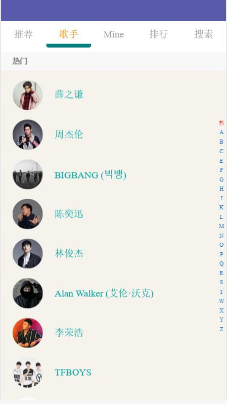
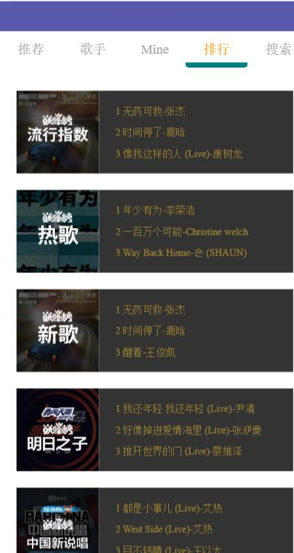
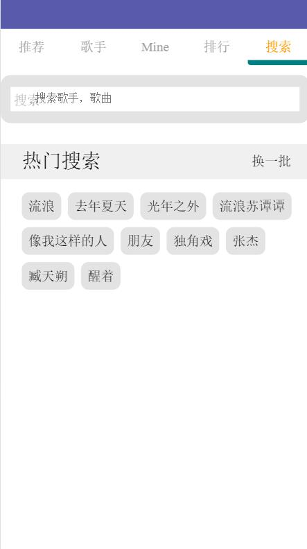
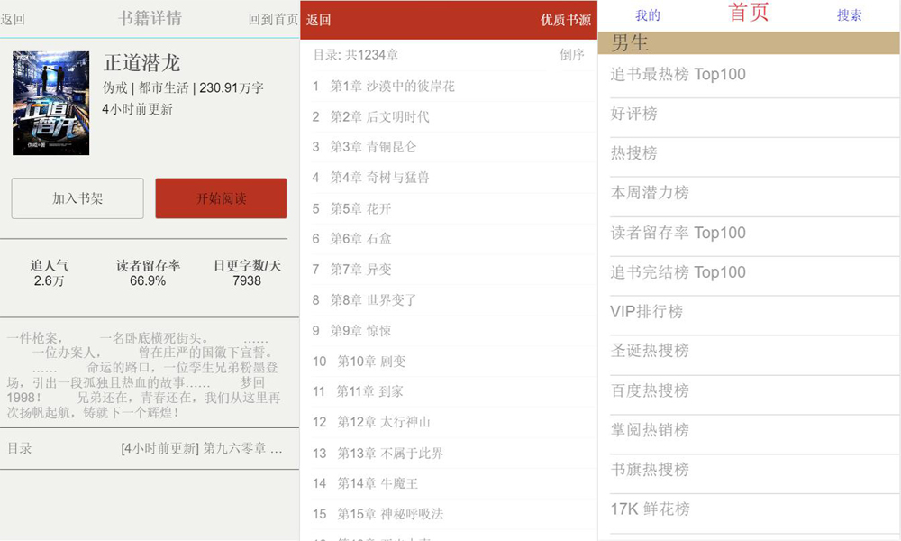
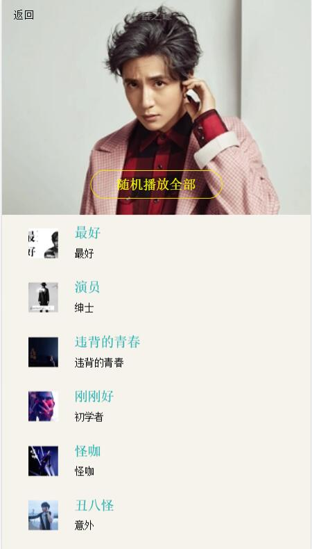
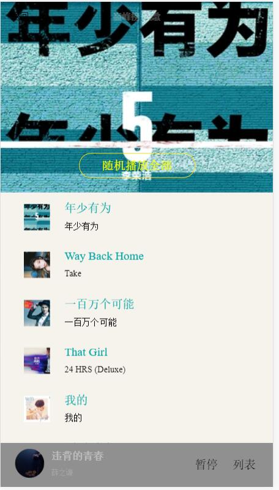
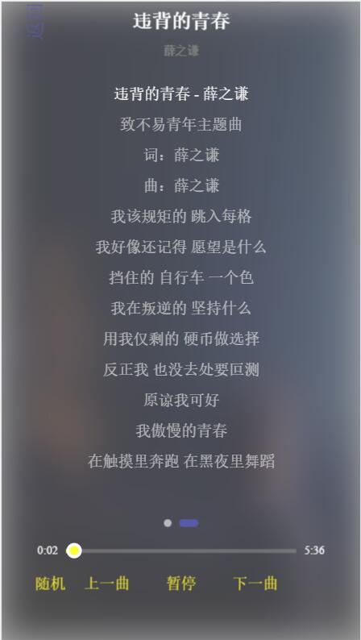

## fashion-music

## 技术栈
1. axios^0.17.0
> 基于Promise的 HTTP库,用来访问接口
2. sass^6.0.6
> CSS预处理器
3. vue-lazyload^1.1.4
> 图片懒加载
4. vue-router^3.0.1
>  Vue.js 官方的路由管理器。它和 Vue.js 的核心深度集成，让构建单页面应用变得易如反掌
5. vuex^3.0.1
> 状态管理
6. jsonp^0.2.1
> 跨域解决方案
7. js-base64^2.3.2
> 二进制编码,处理歌词

## 项目结构
<!-- └──
├── -->
    Fashion-Music
    ├──build   // webpack 相关配置和脚本
    ├──config  // Vue-cli 配置文件
    ├──node_modules //npm命令下载的开发环境和生产环境的依赖包。
    ├──preview  //项目运行界面截图
    ├──src  //项目源码及需要引用的资源文件
        ├── api  // 接口配置,请求以及跨域
        ├── base  // 基础组件, 不做交互等操作
            ├── confirm  // 提示窗口
            ├── list-view  //列表
            ├── loading  //加载中
            ├── ...
        ├── components  //业务组件,实现具体功能
            ├── header //头部
            ├── rank  // 各大歌曲排行榜
            ├── singers //热门歌手列表
            ├── singer //热门歌手歌曲列表
            ├── ...
        ├── js // 共用的函数等
        ├── sass // sass预处理器
        ├── store // vuex相关文件
        ├── main.js  //项目入口
    ├──package.json  //node_modules资源部 和 启动、打包项目的 npm 命令管理
<!-- 
├──dist  //默认 npm run build 命令打包生成的静态资源文件 
-->

## 重点难点
1. 组件划分
2. 接口处理(主要是跨域问题)
3. 上拉刷新下拉加载
4. 双向联动
5. 搜索处理(搜索结果/防抖技术)
6. 事件派发和接收
7. 计算属性
8. Vuex状态管理(可以理解为全局的计算属性)

## 运行界面
<center>



</center>

-------

<center>




</center>

-------

<center>



</center>

-------
# fashion-music

> A Vue.js project

## Build Setup

``` bash
# install dependencies
npm install

# serve with hot reload at localhost:8080
npm run dev

# build for production with minification
npm run build

# build for production and view the bundle analyzer report
npm run build --report
```

# 常用markDown语法

1.   *斜体*或_斜体_
2. **粗体**
3. ***加粗斜体***
4. ~~删除线~~

欢迎来到[VueJs](https://cn.vuejs.org/index.html)
欢迎来到[VueJs](https://cn.vuejs.org/index.html "VueJs")

- 无序列表项 一
- 无序列表项 二
- 无序列表项 三

1. 有序列表项 一
2. 有序列表项 二
3. 有序列表项 三

>>> 请问 Markdwon 怎么用？ - 小白
>
>> 自己看教程！ - 愤青
>
> 教程在哪？ - 小白
> 


* * *
***
*****
- - -
---------------------------------------
```
#include <stdio.h>
int main(void)
{
    printf("Hello world\n");
}
```
在代码区块里面， & 、左、右尖括号包裹的内容会自动转成 HTML 实体
如：
<div class="footer">
   © 2004 Foo Corporation
</div>